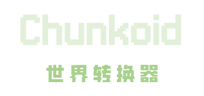

  
  
    
  <a href="#中文">中文</a> | <a href="#english">English</a> | <a href="https://www.chunkoid.top">Website</a>
    
  
  
  
   
  
  
  
  

## 中文

### 项目简介

Chunkoid 是一款专为安卓设备打造的 **Minecraft 世界转换器**。它开源免费，无需电脑即可实现基岩版（Bedrock）与 Java 版之间的存档互转及版本升降。

### 功能特性

- **双端互转**：Bedrock ↔ Java 存档格式转换
- **版本升降**：支持 1.8.8 至 1.21 及 26.x 等多版本升降级
- **材质转换**：JE-BE 材质包双向转换
- **存档解密**：网易版加密存档解密
- **日志输出**：透明化执行过程，每一步清晰可见
- **输出管理**：所有转换结果统一管理，方便导出

### 下载

- [GitHub Releases](https://github.com/DozenesStudio/Chunkoid/releases)
- [Gitee Releases](https://gitee.com/dozenesstudio/Chunkoid/releases)

### 技术栈

- **语言**：Kotlin
- **框架**：Android SDK、Material Components
- **架构**：MVVM
- **构建**：Gradle
- **核心引擎**：[chunker-cli](https://github.com/HiveGamesOSS/Chunker)（MIT License）

### 开源协议

本项目采用 [GNU General Public License v3.0](LICENSE) 协议开源。

### 联系方式

- **作者**：Dozener
- **邮箱**：[DozenesStudio@qq.com](mailto:DozenesStudio@qq.com)
- **QQ群**：1103983368

### 第三方依赖

本项目使用了以下开源软件/SDK：

- **chunker-cli** - [The Hive](https://www.chunler.app)的 [chunker](https://github.com/HiveGamesOSS/Chunker)
  - 许可证：MIT License
  - 文件位置：`app\src\main\assets\cli.jar`
- **存档解密SDK** - [Dicecan](https://github.com/Dicecan)的[NetEaseDecryptorSDK](https://github.com/Dicecan/NetEaseDecryptorSDK)
  - 许可证：GPL v3.0
  - 文件位置：`app\src\main\java\com\dozenesstudio\chunkoid\decryptor`
- **NBT解析器** - [PowerNukkit](https://github.com/PowerNukkit)的[NBT-Manipulator](https://github.com/PowerNukkit/NBT-Manipulator)
  - 许可证：MIT License
  - 文件位置：`nbt`

### 致谢

- Ryan Steven
- Weiyin 1A

---

## English

### Overview

Chunkoid is a **Minecraft world converter** designed exclusively for Android devices. It is open-source and free, enabling Bedrock ↔ Java world conversion and version upgrades/downgrades without requiring a PC.

### Features

- **Cross-Platform Conversion**: Bedrock ↔ Java world format conversion
- **Version Upgrade/Downgrade**: Supports versions from 1.8.8 to 1.21+ and 26.x
- **Resource Pack Conversion**: JE-BE resource pack bidirectional conversion
- **World Decryption**: NetEase encrypted world decryption
- **Conversion Logs**: Transparent execution, every step visible
- **Output Management**: All converted worlds organized in one place

### Download

- [GitHub Releases](https://github.com/DozenesStudio/Chunkoid/releases)
- [Gitee Releases](https://gitee.com/dozenesstudio/Chunkoid/releases)

### Tech Stack

- **Language**: Kotlin
- **Framework**: Android SDK, Material Components
- **Architecture**: MVVM
- **Build Tool**: Gradle
- **Core Engine**: [chunker-cli](https://github.com/HiveGamesOSS/Chunker) (MIT License)

### Open Source License

This project is licensed under the [GNU General Public License v3.0](LICENSE).

### Contact

- **Author**: Dozener
- **Email**: [DozenesStudio@qq.com](mailto:DozenesStudio@qq.com)
- **QQ Group**: 1103983368

### Third-Party Dependencies

This project uses the following open-source software/SDK:

- **chunker-cli** - [Chunker](https://github.com/HiveGamesOSS/Chunker) by [The Hive](https://www.chunler.app)
  - License: MIT License
  - Location: `app\src\main\assets\cli.jar`
- **World Decryption SDK** - [NetEaseDecryptorSDK](https://github.com/Dicecan/NetEaseDecryptorSDK) by [Dicecan](https://github.com/Dicecan)
  - License: GPL v3.0
  - Location: `app\src\main\java\com\dozenesstudio\chunkoid\decryptor`
- **NBT Parser** - [NBT-Manipulator](https://github.com/PowerNukkit/NBT-Manipulator) by [PowerNukkit](https://github.com/PowerNukkit)
  - License: MIT License
  - Location: `nbt`

### Acknowledgments

- Ryan Steven
- Weiyin 1A
