 

## 存档转换出错类型问题

### Q：打开转换后的文件夹一看文件很少，我的世界无法读取（没有level.dat/region/db等关键世界文件）

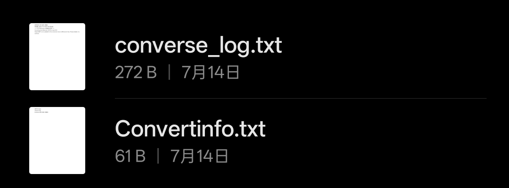

### A：那么请再转换一次，转换时注意看日志的内容（或者去设置>启用日志导出功能）转换时仔细观察日志输出内容，对照以下内容排错

 

### Q：导入存档显示

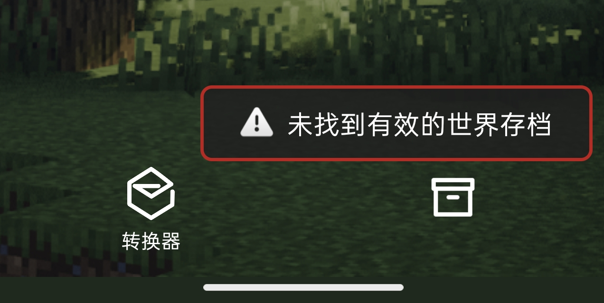

### A：确保你的压缩包里面包含正确的存档，或者直接解压缩出来用文件夹的方式导入

 

### Q：转换时出现Termux environment not initiatialized

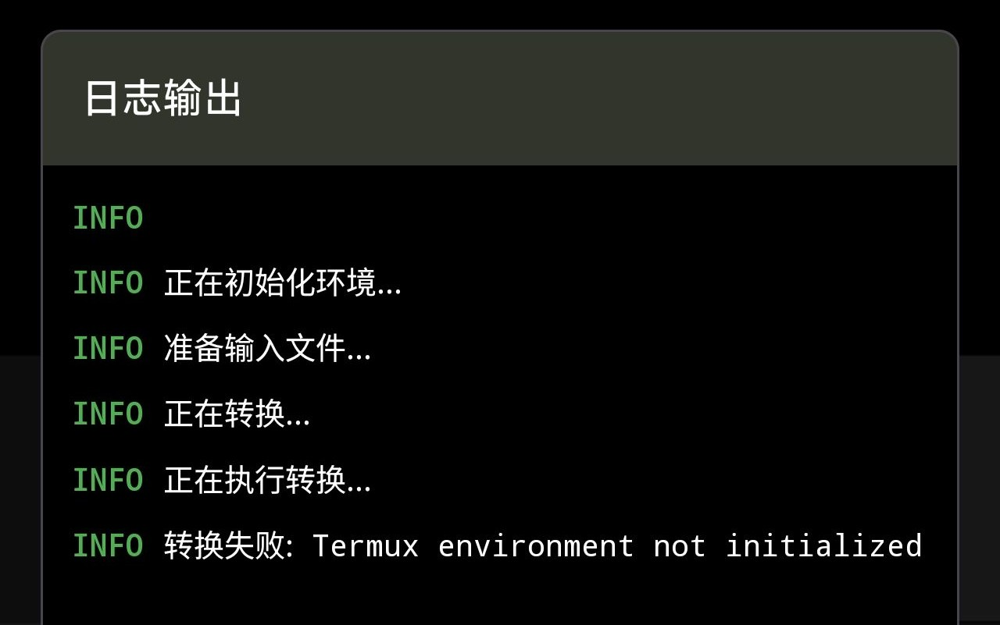

### A：下载最新版，重新安装软件，先把老版本卸载了，不要选择覆盖安装

 

### Q：转换时出现以下问题

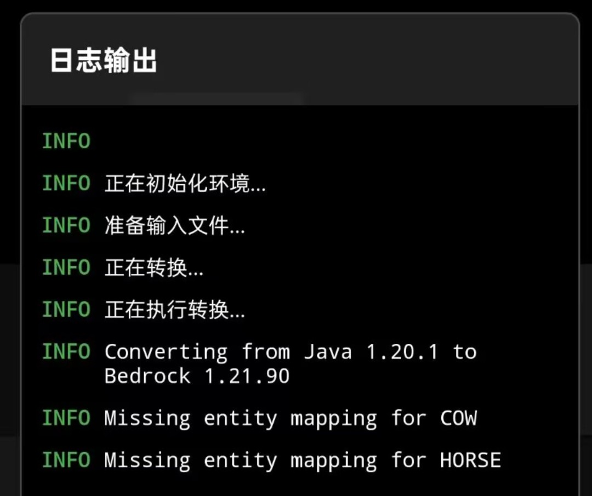

### A：可以无视，不影响转换结果，这是核心转换机制的问题，无法避免，输出存档会造成实体丢失

 

### Q：转换时出现Original NBT is not available for this conversion due to differing formats. Please disable it to continue 

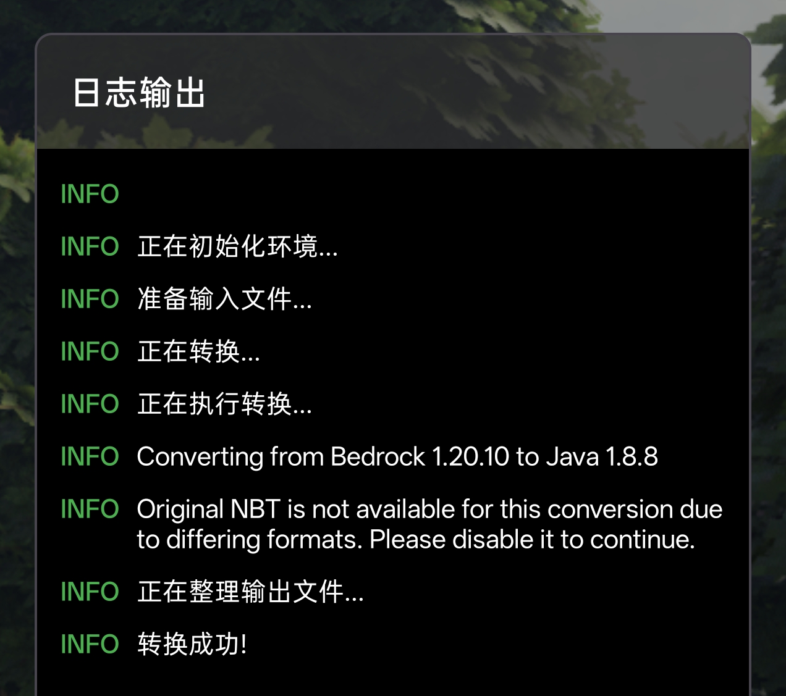

### A：去设置页面把【保留原始NBT】选项关掉

 

### Q：转换时进度条长时间卡住，最后显示out of memory错误

### A：去设置页面转换内存分配调大一点，根据手机实机性能酌量分配

 

### Q：转换时日志疯狂输出信息

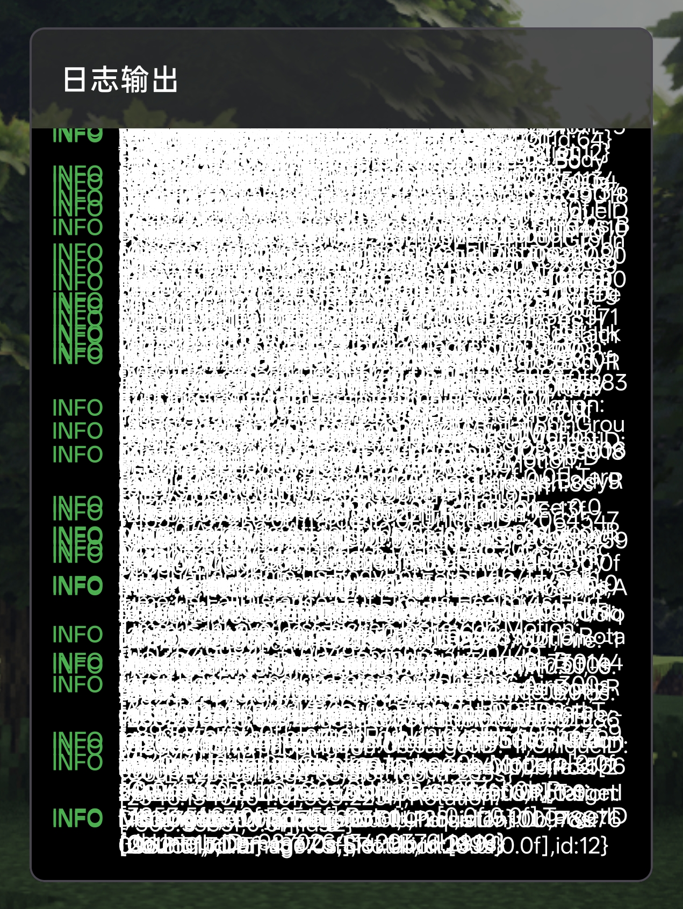

### A：只要到最后出现Conversion complete! Took Oh Om 16s 389ms 等字样，就可以忽视

 

### Q：转换错误显示 转换失败：Chunker exited with code:1

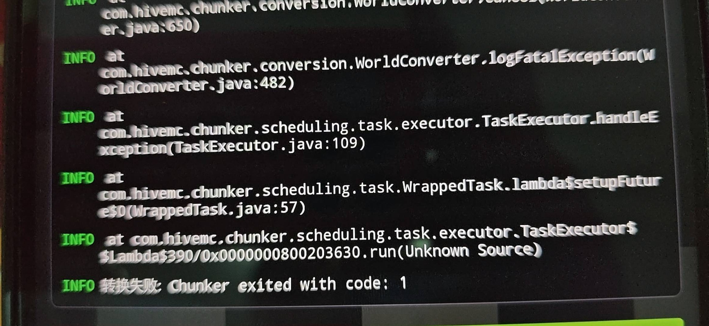

### A：检查这是不是网易没有解密的存档，若不是则代表存档已损坏，Chunker reader无法读取你的存档（罕见情况，大概因为存档内置过多模组）若你还存疑或者转换对你很重要，请访问[QQ群社区](../about.html)寻求帮助

 

### 若以上问题都不是你遇到的，请加入[QQ群社区](../about.html)联系作者寻求帮助，我会不定时查看QQ群，回复你的问题

 

 

## 软件使用建议类

### Q：选择错误的世界之后更换想换？

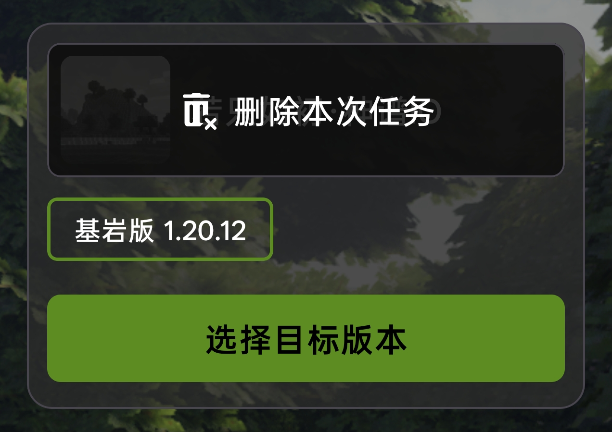

### A：很简单，直接长按世界名字显示的框，点击【删除本次任务】即可

 

### Q：愁网易存档带加密无法转换？

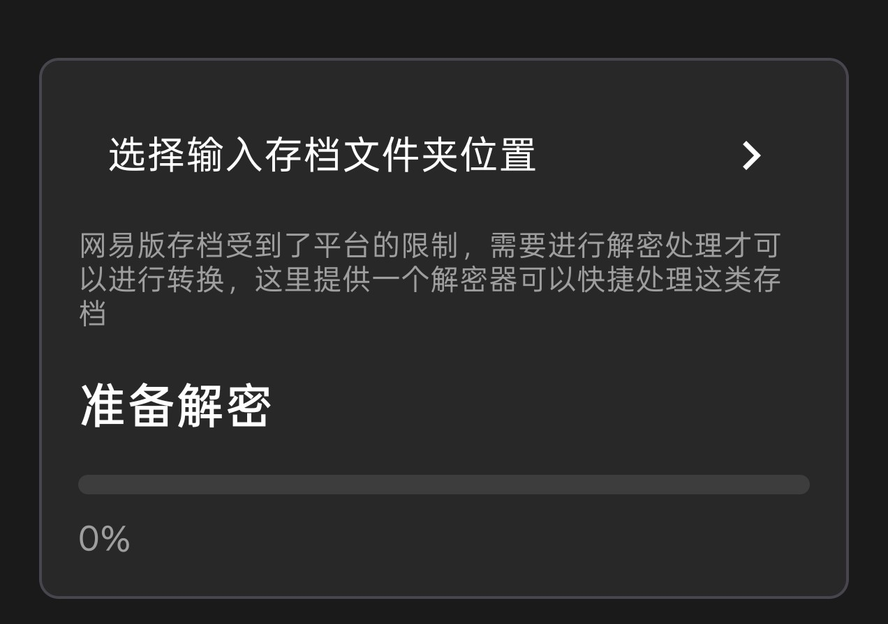

### A：存档解密器套件现已上线，一键解密，扫除障碍

 

### Q：存档内置强关联性材质包？

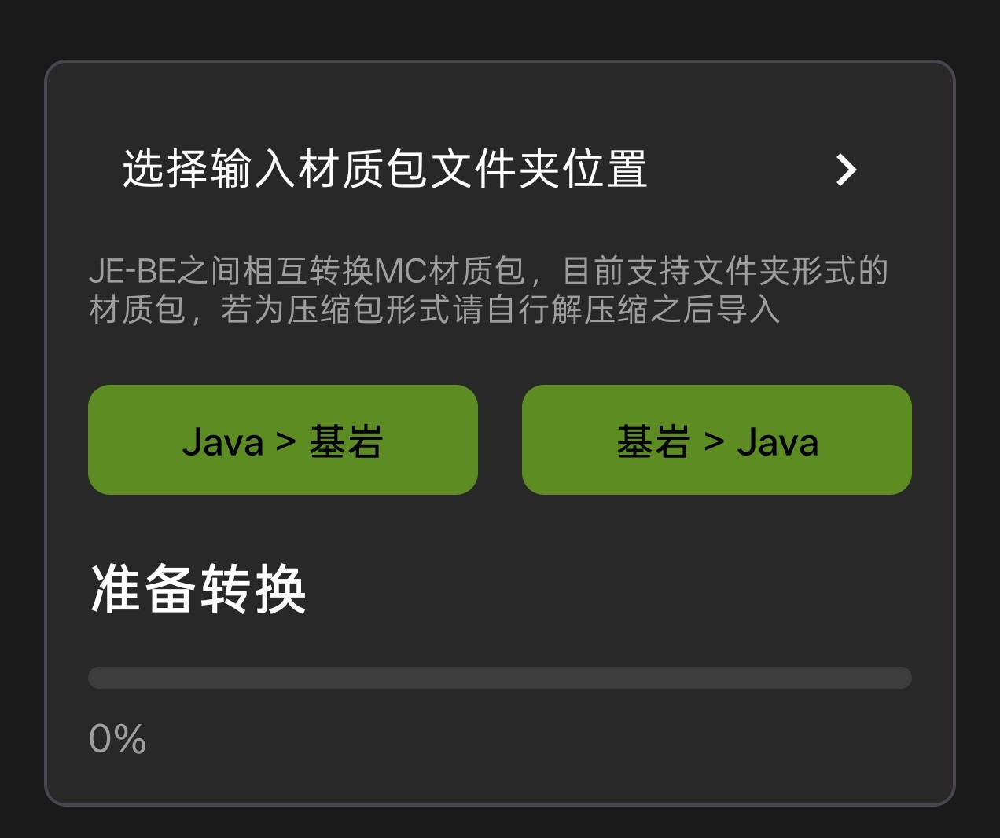

### A：材质转换器套件现已上线，JE-BE双端材质转换，一站式获取最佳体验

 

### Q：我是Termux糕手，之前习惯了拿termux敲命令Chunker-cli转存档，以使用更底层全面的功能

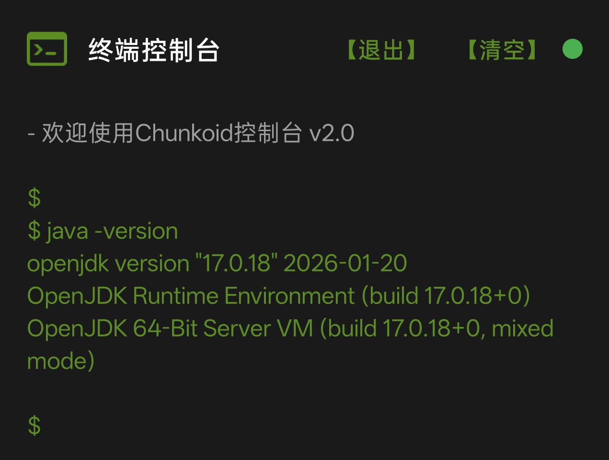

### A：终端控制台提供简易的terminal会话环境，无需各种复杂环境配置，直接还原termux层面的各种操作

 

